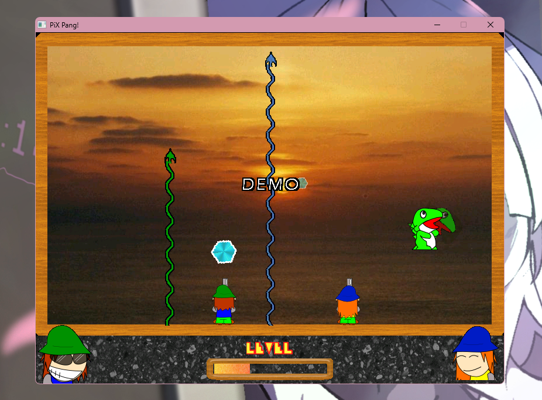

# PiX Pang 2.0
**PiX Pang 2.0** pero con soporte para Windows Vista en adelante.

---

## ¿Por qué?
Recordemos que PiX Pang 2.0 está compilado en una build de Fénix 0.84, la cual es del 15 de noviembre del 2003, en aquel entonces Windows Vista ni siquiera estaba cerca de lanzarse.

Tras la salida de Windows Vista, resultó que todos los juegos que se hicieron con Fénix 0.84 dejaron de funcionar, con el error más común siendo el "Error al abrir (juego).dcb".

Para ejecutar estos juegos, se necesitaba por lo menos una máquina virtual con Windows XP o una distro de Linux con Wine instalado. Obviamente, en lo personal esto me era un dolor de cabeza, así que decidí trabajar en ello.

---

## ¿Cómo?
En los últimos cinco años, cada tanto le dedicaba un poco de tiempo a arreglar este bug. No lo voy a negar, fue un dolor de cabeza y no lo logré hasta julio de 2026.

Usando **x32dbg** y con ayuda de la inteligencia artificial, logré debuggear el programa y arreglar los bugs para que finalmente pudiese correr. 

Sin ir a lo técnico, básicamente el problema estaba en los binarios de Fénix, donde el modo de apertura de archivos (**rb**, **wb**, etc) incluian un '0' extra. Fénix incluia el '0' extra para hacer una especie de truco, que si bien para sistemas operativos como Windows XP funcionaba perfectamente, a partir de Windows Vista esto ya no funcionaba.

Lo que hice fue parchear el binario de **pixpang.exe** (que como tal, es simplemente un **FXI**) sacando lo anterior mencionado. Suena simple, pero me tomó varios días debuggearlo incluso con ayuda de la inteligencia artificial.

En teoría, lo parcheado es lo siguiente:
* Carga de DCB
* File I/O (fopen() y fgets())
* Carga de FPG

---

## Bugs
**1. El modo de pantalla completa no funciona.**

> Solución: Reemplaza las librerías de la carpeta raíz por las de la carpeta **fs-patch**.

**2. Mi configuración no se guarda / Mi partida no se guarda**

> Solución: Por ahora no la hay, luego le echo un vistazo. Probablemente sea el mismo problema del File I/O.
